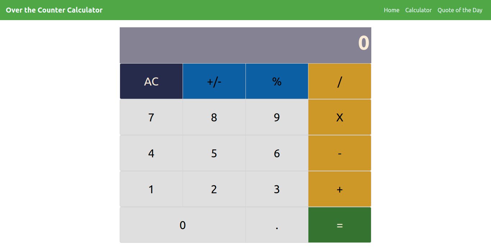

# Calculator App - Using React

This is a Calculator app created using React

## Built With
1. JavaScript / ES6
2. React.js
3. Jest
4. Enzyme
5. HTML5
6. CSS3

## App Screenshot

## Live Demo
Available [here](https://calculator-anewman15.herokuapp.com/)

## Deployment
1. Open your Terminal from a folder of your choice and clone [this repo](https://github.com/anewman15/react-calculator/)
2. Navigate to the project directory
3. Run `npm install`
4. Then run `npm run start`
5. Open `http://localhost:3000` in your browser and navigate around the site.
6. Navigate through the website and find the Calculator app page
7. Make calculations

## Author

👤 **Abdullah Numan**

- Github:   https://github.com/anewman15
- Twitter:  https://twitter.com/aanuman15
- Linkedin: https://www.linkedin.com/in/aanuman15/
- Email:    anewman15@hotmail.com

##    Contributing

Contributions, issues and feature requests are welcome!
Please send your feedback [here](https://github.com/anewman15/react-calculator/issues)

## Show your support

Give a ⭐️ if you like this project!